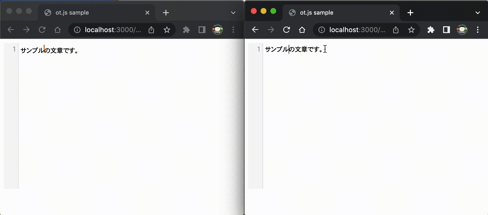
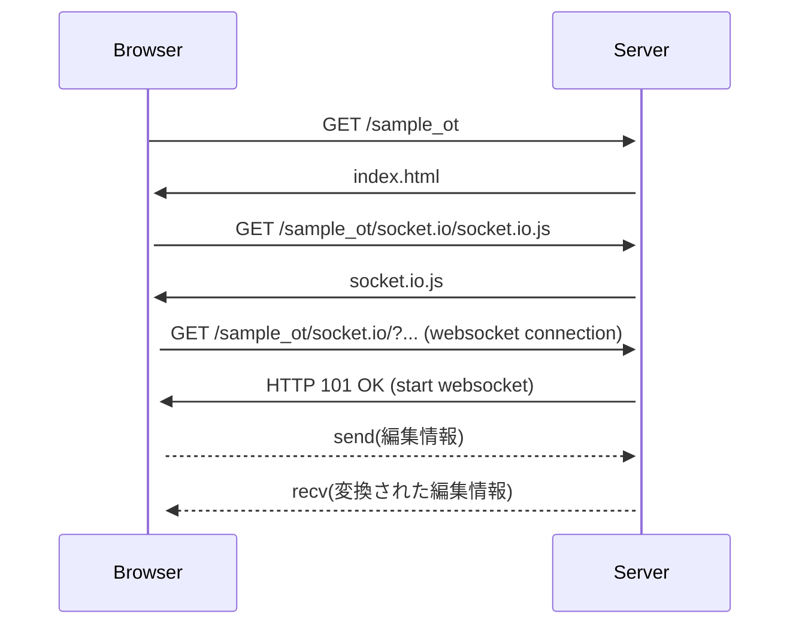
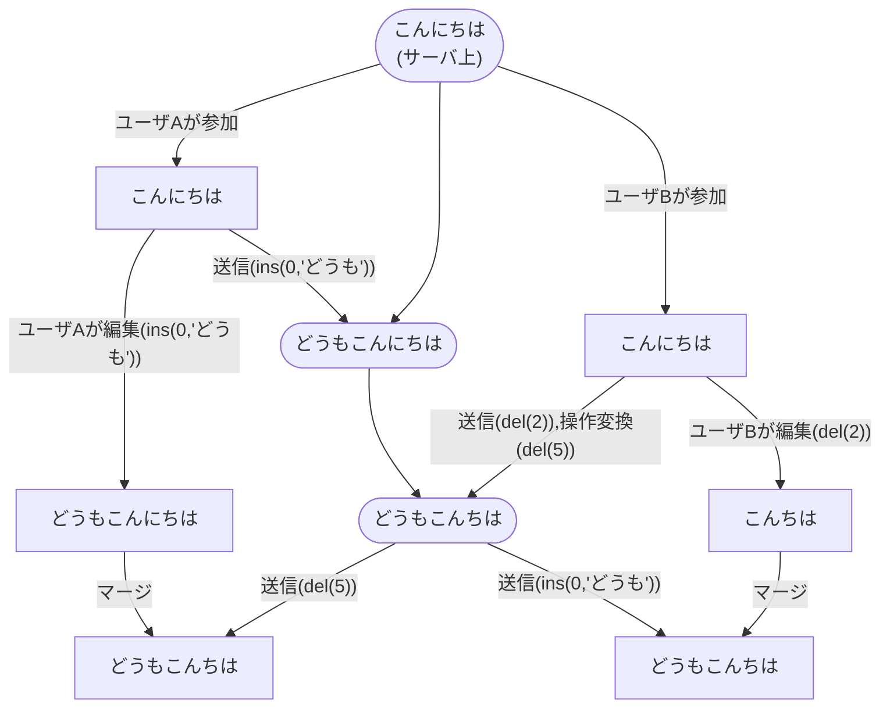

# ot.jsサンプル

[ot.js](https://github.com/Operational-Transformation/ot.js)を使用したサンプルです。

ot.jsは複数人での文書の同時編集を実現する技術である、Operational Translformation[*1](https://www.lri.fr/~mbl/ENS/CSCW/2017/papers/Ellis-SIGMOD89.pdf)[*2](https://dl.acm.org/doi/pdf/10.1145/289444.289469)を実装したライブラリです。
サーバとクライアントの両方が提供されていて、簡単なコードで文書の同時編集が実現できます。


## 動作イメージ




## ビルド・起動方法

nodejs v15.14.0で動作を確認しています。

### ライブラリのインストール
```
npm install
```
### サーバの起動
```
node server.js
```


## 動作シーケンス

サーバ起動後 http://localhost:3000/sample_ot にアクセスすると、テキストエディタが表示されます。テキストエディタへの編集は即時に反映され、その内容がサーバにも送られます。サーバでは今までの編集履歴を考慮して編集操作を変換し、ブラウザに送ります。ブラウザでも必要に応じて変換操作が行われ、反映されます。この操作の変換により、複数人で同時に編集しても、結果が同じになります。



## Operational Transformation(操作変換)



